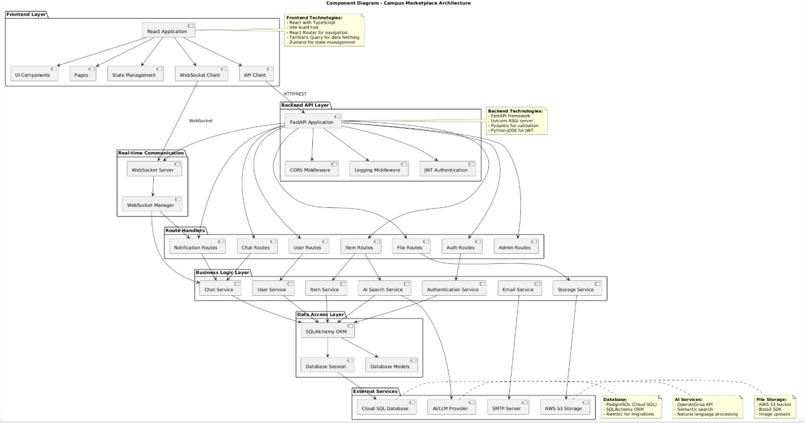
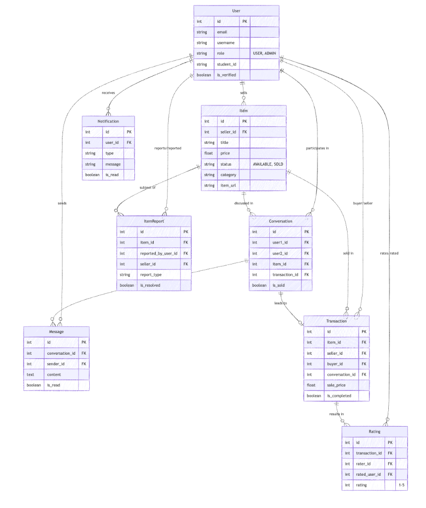

# Campus Marketplace

Campus Marketplace is a full-stack web application I built to let university communities securely buy and sell campus essentials like textbooks, electronics, furniture, and more. The product pairs a modern React + TypeScript frontend with a FastAPI backend, real-time WebSocket chat and notifications, secure JWT auth, admin moderation workflows, and an AI assistant that helps users navigate listings and troubleshoot common actions. The stack is containerized for easy local development or cloud deployment, with optional S3-compatible storage for media and configurable LLM providers for the AI features.

### Author

- **Dhruv Jain**

### Project Documentation

- **[Project Journal](https://docs.google.com/document/d/1k4Cxj5CZhuSkujyZzvqx_-QUTN2LeHqgr2WkhFjGBhE/edit?usp=sharing)** : Describes development progress across the semester, key design decisions, trade-offs, and retrospective notes for each milestone.
- **[Sprint Planning Board](https://docs.google.com/spreadsheets/d/1XOtjGHiU-msNxfMrv_1v8qGj2N9KuYmvwxYC9nZExxU/edit?usp=sharing)**: Captures sprint goals, user stories, assignees, priorities, and completion status across all sprints for the course.
- **[UI Wireframes](https://app.visily.ai/projects/9d208fc9-889b-4746-b34d-216d385bb976/boards/2366796)**: High-level visual mockups for core flows (authentication, home feed, item details, chat, admin pages) used as a reference for implementation.


### Architecture Diagrams

Diagrams are included as placeholders for the current design references.

- **Component Diagram**  
  

- **Deployment Diagram**  
  

- **Database Schema**  
  

- **Auto Scaling**  
  

- **Load Balancer**  
  


### Technology Stack

- **Frontend**
  - React + TypeScript + Vite
  - Tailwind CSS and shadcn/ui component library
  - React Router and @tanstack/react-query for routing and data fetching
  - Custom WebSocket client for real-time chat and notifications

- **Backend**
  - FastAPI (Python) with Pydantic for request/response models
  - SQLAlchemy ORM and PostgreSQL for persistence
  - JWT-based authentication and role-based access control (user vs. admin)
  - WebSockets for chat and real-time notifications

- **Infrastructure & Tooling**
  - Docker and Docker Compose for containerized local development
  - Backend deployable to GCP (e.g., Cloud Run) with PostgreSQL (Cloud SQL or container)
  - Optional AWS S3 or compatible object storage for images; local file storage supported by default
  - Optional AI provider (LLM API) for the in-app assistant


### Feature Set

#### User Authentication & Profiles

- **Account Management**
  - Student-focused signup and login flows with validation
  - Role-aware behavior (standard user vs. admin)
  - Profile management for contact details and basic stats

- **Security & Session Handling**
  - JWT-based access tokens for secure API access
  - Guarded routes on the frontend for authenticated and admin-only pages

#### Listings & Search

- **Item Management**
  - Create, edit, and delete listings for textbooks, electronics, furniture, clothing, and more
  - Rich item metadata (title, description, condition, category, location, negotiable flag)
  - Image upload with client-side cropping and drag-and-drop support

- **Search & Discovery**
  - Keyword search with filters for category, condition, and price range
  - Sort options for relevance, price, and recency
  - Home page layout optimized for quick browsing of available items

#### Real-Time Chat & Notifications

- **Buyer–Seller Chat**
  - WebSocket-based chat channel per conversation
  - Contextual entry into chat directly from item detail pages

- **Notifications**
  - Real-time notifications for new messages, item reports, and important admin actions
  - Browser notifications (where supported and permitted) for key events

#### Admin Portal

- **User Management**
  - Admin-only dashboard for viewing and managing users
  - Ability to deactivate or delete users, with safeguards around self-deletion
  - Admins may modify only their own password and security answer via a secure flow

- **Listing Management**
  - Admin views for reviewing and moderating user listings
  - Filtering and quick navigation to problematic or reported items

#### Reporting & Moderation

- **Item Reporting Workflow**
  - Structured reporting reasons (e.g., incomplete information, missing photos, inappropriate content, other)
  - Support for custom comments when “Other” is selected
  - Reports are created without automatically altering listing status for the seller

- **Seller & Admin Experience**
  - Sellers receive contextual notifications and can open their listing in edit mode from report prompts
  - Admins review reports in an optimized Admin Reports page that surfaces only the most relevant details
  - Floating report details sidebar on admin listing pages with:
    - Snapshot of item state at the time of report
    - Automatic comparison showing whether the seller has updated the listing
    - Clear “changes detected” vs. “no changes so far” messaging
  - Admin-only “Mark as Fixed” control with confirmation when no seller changes have been detected
  - Dynamic badge count of open reports in the admin navbar that updates in real time

#### AI Assistant

- **Capabilities**
  - Embedded chatbot to help users find listings, understand features, and troubleshoot common issues
  - Integrates with backend APIs to provide context-aware guidance

- **Visibility & UX**
  - Hidden on authentication pages (login/signup) and all admin pages to avoid distraction
  - Remembers minimized/expanded state across navigation using local storage


### Design Decisions

- **Separation of Concerns**
  - Frontend implemented as a React single-page application, decoupled from the FastAPI backend
  - Clear REST and WebSocket APIs for items, authentication, chat, and reporting

- **Responsive Design**
  - Tailwind CSS and shadcn/ui used for a consistent, responsive design system
  - Layouts tested across mobile, tablet, and desktop form factors

- **Security**
  - JWT authentication, role-based authorization checks, and backend-side guards for admin routes
  - Input validation via Pydantic models and additional custom checks
  - Defensive handling of report workflows so only admins can resolve reports or mark them as fixed

- **Performance**
  - React Query used for caching, background refetching, and incremental updates
  - WebSockets used where real-time behavior is required instead of aggressive polling
  - Client-side image handling (cropping and previews) reduces redundant uploads

- **Scalability**
  - Containerized services support deployment to cloud platforms (GCP, AWS, or on-prem)
  - Stateless backend with database-backed persistence for horizontal scaling
  - Architecture designed to allow independent scaling of frontend, backend API, and database


### Getting Started

#### Prerequisites

- **Docker Desktop** – recommended for running the full stack locally  
- **Node.js** v18+ – for frontend development  
- **Python** 3.9+ – for backend development (if not using Docker)  
- **PostgreSQL** – if running the database locally outside Docker  


#### 1. Clone the Repository

```bash
git clone <repository-url>
cd campus-marketplace
```


#### 2. Backend Setup (with Docker – Recommended)

```bash
cd backend
cp .env.example .env
# Edit .env with your local or cloud configuration
```

Key settings in `.env` include database connection details, JWT secret key, CORS origins, optional AWS S3 credentials, and optional AI API keys.

Start the backend and database using Docker Compose:

```bash
cd backend
docker-compose up --build
```

Once running, the backend will be available at:

- **API**: `http://localhost:8000`  
- **API Docs (Swagger)**: `http://localhost:8000/docs`  

An admin user is automatically created at container startup.

- **Default admin credentials** (change immediately after first login):
  - Username: `admin`
  - Password: `admin123`
  - Security Answer: `Baahubali`

If needed, you can manually (re)create the admin user:

```bash
docker-compose exec backend python create_admin.py
```


#### 3. Frontend Setup

In a new terminal:

```bash
cd frontend
npm install
```

Optionally, create a `.env` file in `frontend` to point to a specific backend instance:

```env
VITE_API_BASE_URL=http://localhost:8000
```

Start the development server:

```bash
npm run dev
```

The frontend will be available at `http://localhost:8080`.


#### 4. Running Without Docker (Alternative)

If you prefer to run services directly on your machine:

1. **Backend**
   ```bash
   cd backend
   python -m venv venv
   # Windows
   venv\Scripts\activate
   # macOS / Linux
   # source venv/bin/activate

   pip install -r requirements.txt
   cp .env.example .env
   # Edit .env for your local PostgreSQL instance

   python main.py
   # or: uvicorn main:app --reload --host 0.0.0.0 --port 8000
   ```

2. **Frontend** – same steps as above (`npm install`, `npm run dev`).


### Database Migrations

After pulling the latest code or whenever the database schema changes:

```bash
# If using Docker
cd backend
docker-compose exec backend python run_migration.py

# If running services locally
cd backend
python run_migration.py
```

This script updates the PostgreSQL schema (for example, adding new columns for item reports or AI features) in place.


### Stopping the Application

```bash
# From the backend directory
cd backend
docker-compose down          # Stop containers
docker-compose down -v       # Stop containers and remove volumes (including database data)
```

If running without Docker, stop the backend and frontend processes with `Ctrl + C` in their respective terminals.


### Updating from GitHub

When pulling the latest changes:

1. **Pull the code**  
   ```bash
   git pull origin main
   ```

2. **Rebuild backend containers** (if Dockerfile or dependencies changed)  
   ```bash
   cd backend
   docker-compose up --build
   ```

3. **Run database migrations** (if schema changes were made)  
   ```bash
   docker-compose exec backend python run_migration.py
   ```

4. **Update frontend dependencies** (if `package.json` changed)  
   ```bash
   cd frontend
   npm install
   ```


### Troubleshooting

- **Database Connection Issues**
  - Ensure PostgreSQL is running (or the database container is healthy)
  - Verify that `.env` database settings match your environment
  - For local PostgreSQL, confirm the database exists using `psql -U postgres -l`

- **Ports Already in Use**
  - Backend: use `uvicorn main:app --port 8001` or adjust Docker Compose ports
  - Frontend: Vite automatically chooses the next free port, or configure in `vite.config.ts`

- **File Storage**
  - Local uploads are stored under the backend’s `uploads/` directory
  - To use S3 or another object store, configure the corresponding environment variables in `.env`

- **AI Assistant**
  - Requires a valid LLM API key in `.env`  
  - If no key is configured, AI features are automatically disabled and the rest of the app functions normally


### Project Structure

```text
.
├── backend/
│   ├── app/               # FastAPI application code
│   ├── main.py            # Backend entry point
│   ├── Dockerfile         # Backend container definition
│   ├── docker-compose.yml # Backend + PostgreSQL local stack
│   └── requirements.txt   # Python dependencies
├── frontend/
│   ├── src/               # React + TypeScript source
│   ├── package.json
│   └── vite.config.ts
└── design/                # Design assets and wireframes
```


### Additional Documentation

- [FastAPI Documentation](https://fastapi.tiangolo.com/)  
- [React Documentation](https://react.dev/)  
- [Vite Documentation](https://vitejs.dev/)  
- [Tailwind CSS Documentation](https://tailwindcss.com/docs)  
- [shadcn/ui Documentation](https://ui.shadcn.com/)  

These resources provide in-depth technical reference for the primary frameworks and tools used in Campus Marketplace.
